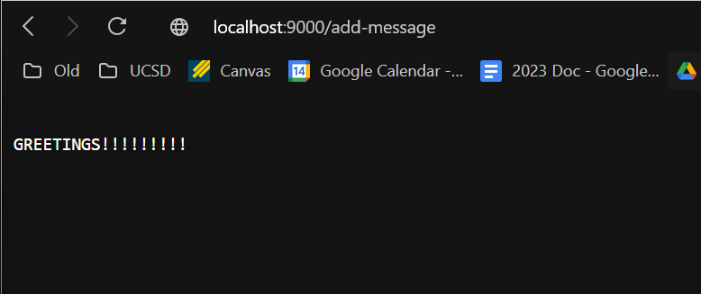
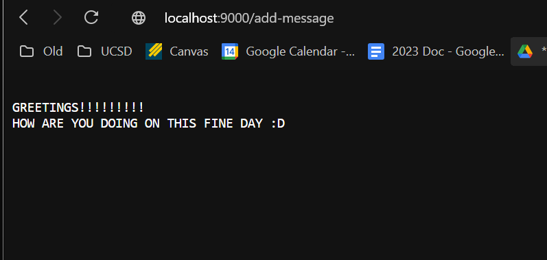
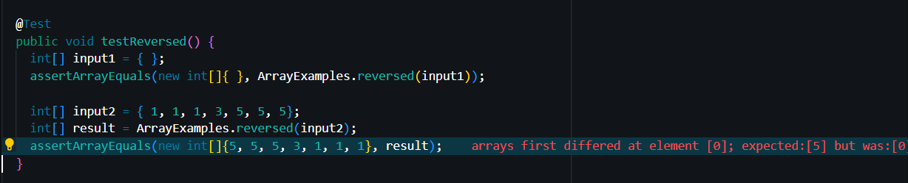

# Lab 3 Write Up

### Part 1)

Here is the code for StringServer:

```
import java.io.IOException;
import java.net.URI;

class StringServer implements URLHandler {
    String message = "";

    public String handleRequest(URI url) {
        if (url.getPath().equals("/")) {
            return message;
        } else {
            System.out.println("Path: " + url.getPath());

            // Add to String
            if (url.getPath().contains("/add-message")) {
                String[] parameters = url.getQuery().split("=");
                if (parameters[0].equals("s")) {
                    message += "\n" + parameters[1];
                    return message;
                }
            }

            return "404 Not Found!";
        }
    }
}

class SearchEngine {
    public static void main(String[] args) throws IOException {
        if(args.length == 0){
            System.out.println("Missing port number! Try any number between 1024 to 49151");
            return;
        }

        int port = Integer.parseInt(args[0]);

        Server.start(port, new StringServer());
    }
}
```
__Screenshot 1__


For the first screenshot the main methods being called are the handleRequest method. The method takes in a URI argument which I presume is what gives
the method what the user added to the URL. The main relevant value of the method
is the "message" string in which is what the user adds onto. From the 
add-message request the "message" string will be concantenated with the new 
string input from the URL arguemnt.



For screen shot 2, the exact same methods, arguments, and fields are utilized.
The only difference is that the entire message is once again printed
with the previous messages included.

### Part 2)

Failure Induced Input
```
  @Test
  public void testReversed() {
    int[] input2 = { 1, 1, 1, 3, 5, 5, 5};
    int[] result = ArrayExamples.reversed(input2);
    assertArrayEquals(new int[]{5, 5, 5, 3, 1, 1, 1}, result);
  }
```

Non Failure Inducing Input
```
int[] input1 = { };
    assertArrayEquals(new int[]{ }, ArrayExamples.reversed(input1));
```

Symptom


The Bug
Before:
```
static int[] reversed(int[] arr) {
    int[] newArray = new int[arr.length];
    for(int i = 0; i < arr.length; i += 1) {
      arr[i] = newArray[arr.length - i - 1];
    }
    return arr;

  }
  ```
 
 After
 
 ```  static int[] reversed(int[] arr) {
    int[] newArray = new int[arr.length];
    for(int i = 0; i < arr.length; i += 1) {
      newArray[i] = arr[arr.length - i - 1];
    }
    return newArray;
  }
  ```
  
  The main fixed consisted of swapping the newArray and arr values. As most of the time the inputs would be properly
  reversed but into the wrong array and using values from the incorrect array. As a result the returned array
  would be filled with zeros. Therefor eby swapping thne two arrays, the correct values are reversed and put
  intot the correc tarray.
  
  
  ### Part 3)
  
  The main thing I learned was how seemingly simple it was to create a website with GIT
